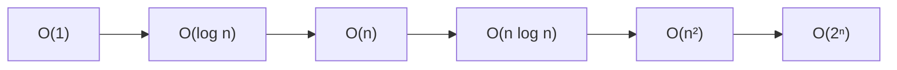
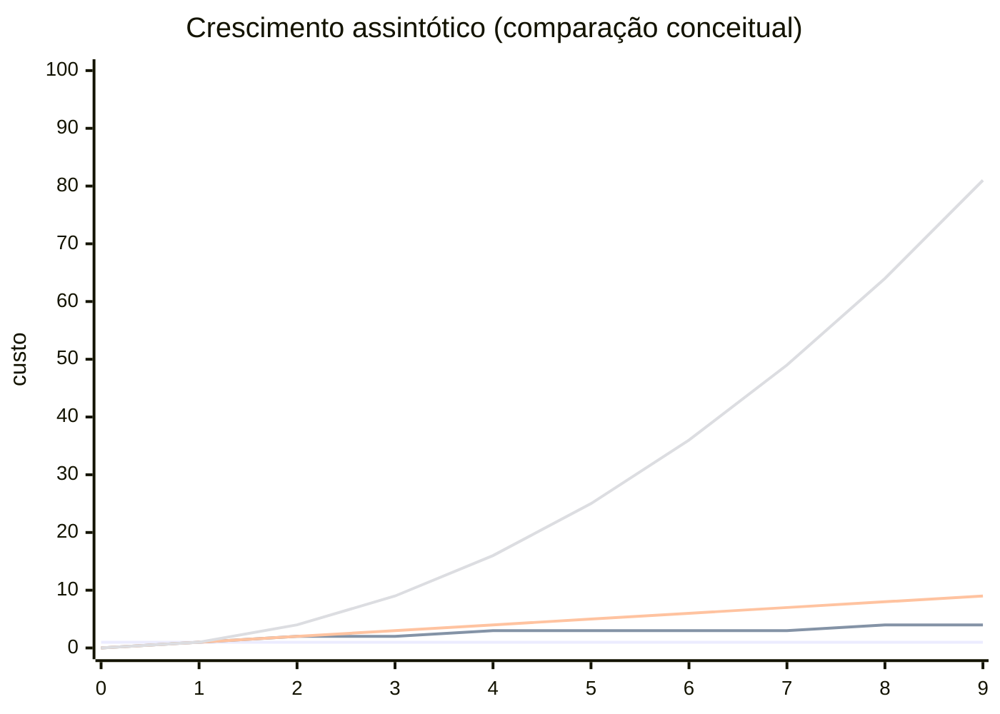

## O que é a notação Big-O

A notação Big-O descreve como o custo de um algoritmo cresce conforme o tamanho da entrada aumenta. Esse custo pode representar tanto tempo de execução quanto uso de memória, dependendo do tipo de análise.

Em vez de medir tempo real, que varia de máquina para máquina, a análise foca no comportamento assintótico, ou seja, no crescimento da função quando n se torna grande.

O objetivo não é saber exatamente quanto tempo um algoritmo leva, mas entender como ele escala.

## Por que não é utilizado o tempo real

Medidas de tempo real dependem de fatores externos como hardware, sistema operacional, linguagem e otimizações do compilador. Isso torna comparações injustas ou inconsistentes.

A análise assintótica resolve esse problema ignorando detalhes de implementação e focando apenas no crescimento da função.

## Como a função de custo é construída

Cada instrução de um algoritmo pode ser associada a um custo. Ao contar quantas vezes cada instrução é executada em função de n, obtemos uma função matemática de custo.

Por exemplo:

```java id="a1k9lm"
int soma = 0;

for (int i = 0; i < n; i++) {
    soma = soma + i;
}

System.out.println(soma);
```

Esse algoritmo pode ser representado por uma função como:

```text id="b8m2ld"
f(n) = 3n + 4
```

## Por que é utilizado apenas o termo dominante

Quando analisamos crescimento assintótico, estamos interessados no comportamento para valores muito grandes de n. Nesse cenário, os termos menores se tornam irrelevantes.

Considere:

```text id="c9p3ld"
f(n) = 3n² + 10n + 7
```

Para n pequeno, todos os termos influenciam o resultado. Porém, para n grande, o termo n² cresce muito mais rápido do que n ou constantes. Isso faz com que ele domine completamente o comportamento da função.

Por isso, simplificamos para:

```text id="d2k8sd"
O(n²)
```

Essa simplificação não é perda de informação, mas uma forma de focar no fator que realmente impacta o crescimento.

## Classes de complexidade ordenadas por crescimento

A tabela abaixo apresenta as principais classes de complexidade organizadas do melhor para o pior crescimento.

| Classe     | Nome         | Comportamento            |
| ---------- | ------------ | ------------------------ |
| O(1)       | Constante    | não cresce com n         |
| O(log n)   | Logarítmica  | cresce muito lentamente  |
| O(n)       | Linear       | cresce proporcionalmente |
| O(n log n) | Linearítmica | crescimento moderado     |
| O(n²)      | Quadrática   | crescimento rápido       |
| O(2ⁿ)      | Exponencial  | crescimento explosivo    |

Quanto mais abaixo na tabela, mais caro o algoritmo se torna para entradas grandes.

## Comparação visual de crescimento



Esse gráfico mostra que pequenas diferenças na fórmula podem gerar impactos enormes no desempenho quando n cresce.

## Crescimento aproximado das funções



O gráfico é apenas ilustrativo, mas ajuda a visualizar como cada classe cresce em relação às outras.

## Tempo e espaço na análise de complexidade

A notação Big-O pode ser usada para analisar dois aspectos diferentes de um algoritmo.

O primeiro é o **tempo de execução**, que mede quantas operações são realizadas em função de n. Por exemplo, um algoritmo O(n²) executa muito mais operações do que um O(n) quando a entrada cresce.

O segundo é o **espaço em memória**, que mede quanto armazenamento adicional o algoritmo precisa. Um algoritmo pode ser rápido, mas consumir muita memória, ou consumir pouca memória, mas ser lento.

Por exemplo, um algoritmo de ordenação pode ser O(n log n) em tempo e O(1) em espaço, enquanto outro pode ser O(n log n) em tempo e O(n) em espaço.

Essa distinção é importante porque em sistemas reais muitas vezes há um trade-off entre tempo e memória.

## Busca linear e busca binária

A busca linear percorre todos os elementos até encontrar o valor desejado, resultando em O(n). Já a busca binária divide o problema ao meio a cada passo, resultando em O(log n), mas exige que o conjunto esteja ordenado.

Essa diferença mostra como a estrutura de dados influencia diretamente a complexidade.

## Conclusão

A notação Big-O é uma ferramenta fundamental para análise de algoritmos porque permite abstrair detalhes de implementação e focar apenas no crescimento.

O uso do termo dominante não é uma simplificação arbitrária, mas uma consequência direta do comportamento das funções para grandes valores de entrada. Em escala, apenas o crescimento mais significativo importa, enquanto os demais termos perdem relevância.

Com isso, é possível comparar algoritmos de forma objetiva e tomar decisões mais eficientes sobre tempo e espaço.
