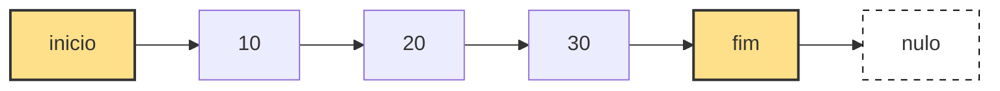
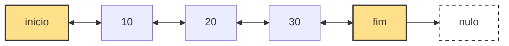
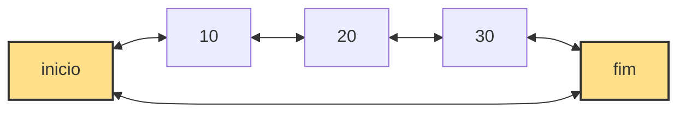

## Introdução

Estruturas de listas encadeadas são formas de organizar dados dinamicamente na memória. Elas diferem principalmente na forma como os nós se conectam entre si e na presença ou ausência de referências para nós anteriores ou ciclos.

A seguir são apresentadas as três variações mais comuns: lista simplesmente encadeada, lista duplamente encadeada e lista circular.

## Lista simplesmente encadeada

Na lista simplesmente encadeada cada nó aponta apenas para o próximo. O último nó não aponta para nenhum outro, indicando o fim da estrutura.

Esse modelo é eficiente em uso de memória, porém limitado em navegação, já que o percurso só pode ser feito em um sentido.

## Lista duplamente encadeada

Na lista duplamente encadeada cada nó possui referência para o próximo e também para o anterior. Isso permite navegação bidirecional.

A estrutura exige mais memória, porém oferece maior flexibilidade em operações como inserção e remoção em qualquer posição.

## Lista circular

Na lista circular o último nó não aponta para null. Em vez disso, ele conecta novamente ao primeiro nó, formando um ciclo contínuo.

Esse modelo é útil quando o processamento precisa ser contínuo, como em escalonamento de processos ou buffers circulares. A lista circular pode ser simplesmente ou duplamente encadeada.

## Comparação entre os modelos

| Característica                | Simples       | Dupla                | Circular        |
| ----------------------------- | ------------- | -------------------- | --------------- |
| Direção de navegação          | Unidirecional | Bidirecional         | Circular        |
| Referência ao anterior        | Não           | Sim                  | Opcional        |
| Fim da estrutura              | null          | null nas duas pontas | não possui null |
| Uso de memória                | Menor         | Maior                | Variável        |
| Complexidade de implementação | Baixa         | Média                | Média           |

## Considerações finais

A escolha entre listas simplesmente encadeadas, duplamente encadeadas ou circulares depende diretamente do tipo de problema. Quando o foco é simplicidade e economia de memória, a lista simples é suficiente. Quando há necessidade de navegação flexível, a duplamente encadeada se torna mais adequada. Já a lista circular é indicada para cenários de repetição contínua sem início ou fim definido.
