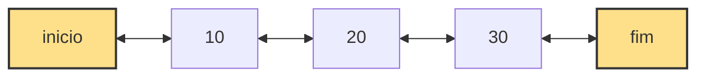

Uma lista duplamente encadeada é uma estrutura de dados linear composta por nós que armazenam um valor e duas referências. Cada nó aponta para o próximo elemento e também para o elemento anterior, permitindo navegação em ambos os sentidos.

A estrutura mantém dois ponteiros principais chamados inicio e fim. O inicio aponta para o primeiro nó da sequência e o fim aponta para o último nó, o que permite operações eficientes nas extremidades.

Diferente de arrays, os elementos não ficam armazenados em posições contíguas de memória. Eles são alocados dinamicamente e conectados por referências duplas, o que aumenta a flexibilidade da estrutura.

## Estrutura

Cada nó contém o valor armazenado e duas referências, uma para o próximo nó e outra para o anterior.

```java id="n3k8aa"
class No {
    int valor;
    No proximo;
    No anterior;

    public No(int valor) {
        this.valor = valor;
        this.proximo = null;
        this.anterior = null;
    }
}
````

A lista mantém três informações essenciais que controlam sua estrutura interna. O inicio representa o primeiro elemento, o fim representa o último elemento e o tamanho indica quantos nós existem na lista.

```java id="l7m2bb"
private No inicio;
private No fim;
private int tamanho;
```


class ListaDuplamenteEncadeada {

* inicio: No
* fim: No
* tamanho: int

- adicionarInicio(valor: int)
- adicionarFim(valor: int)
- removerInicio(): int
- removerFim(): int
- obterInicio(): int
- obterFim(): int
- obter(indice: int): int
- inserir(indice: int, valor: int)
- remover(indice: int): int
- percorrer()
  }

class No {

* valor: int
* proximo: No
* anterior: No
  }
  

## Representação visual da lista

A lista duplamente encadeada permite navegação em dois sentidos, pois cada nó conhece seu próximo e seu anterior.



Cada nó possui duas conexões, o que facilita operações como remoção no fim sem necessidade de percorrer toda a lista.

## Ideia principal

A principal ideia da lista duplamente encadeada é permitir acesso bidirecional aos elementos. Isso significa que é possível percorrer a lista tanto do início para o fim quanto do fim para o início.

Com os ponteiros inicio e fim, operações nas extremidades se tornam eficientes. A presença do ponteiro anterior também reduz a necessidade de percorrer a estrutura em algumas operações.

## Adicionar no início

O método adicionarInicio insere um novo nó no começo da lista e ajusta os ponteiros de forma que o antigo primeiro elemento passe a ser o segundo.

```java id="af1"
public void adicionarInicio(int valor) {
    No novo = new No(valor);

    if (inicio == null) {
        fim = novo;
        inicio = fim;
    } else {
        novo.proximo = inicio;
        inicio.anterior = novo;
        inicio = novo;
    }

    tamanho++;
}
```

Essa operação é constante porque apenas ajustes locais de ponteiros são necessários.

## Adicionar no fim

O método adicionarFim insere um novo elemento no final da lista utilizando o ponteiro fim.

```java id="af2"
public void adicionarFim(int valor) {
    No novo = new No(valor);

    if (inicio == null) {
        fim = novo;
        inicio = fim;
    } else {
        fim.proximo = novo;
        novo.anterior = fim;
        fim = novo;
    }

    tamanho++;
}
```

Essa operação também é constante, pois não exige percorrer a lista.

## Remover do início

O método removerInicio remove o primeiro elemento e atualiza as referências do segundo nó.

```java id="rf1"
public int removerInicio() {
    if (inicio == null) throw new RuntimeException("Lista vazia");

    int valor = inicio.valor;
    inicio = inicio.proximo;

    if (inicio != null) {
        inicio.anterior = null;
    } else {
        fim = null;
    }

    tamanho--;
    return valor;
}
```

## Remover do fim

O método removerFim utiliza o ponteiro anterior do último nó, eliminando a necessidade de percorrer a lista.

```java id="rf2"
public int removerFim() {
    if (inicio == null) throw new RuntimeException("Lista vazia");

    int valor = fim.valor;
    fim = fim.anterior;

    if (fim != null) {
        fim.proximo = null;
    } else {
        inicio = null;
    }

    tamanho--;
    return valor;
}
```

Essa operação é constante devido ao ponteiro anterior.

## Obter primeiro elemento

O método obterInicio retorna o valor do primeiro nó da lista.

```java id="gi1"
public int obterInicio() {
    if (inicio == null) throw new RuntimeException("Lista vazia");
    return inicio.valor;
}
```

## Obter último elemento

O método obterFim retorna diretamente o valor do último nó usando o ponteiro fim.

```java id="gf1"
public int obterFim() {
    if (fim == null) throw new RuntimeException("Lista vazia");
    return fim.valor;
}
```

## Obter por índice

O método obter percorre a lista até o índice informado.

```java id="gi2"
public int obter(int indice) {
    if (indice < 0 || indice >= tamanho)
        throw new IndexOutOfBoundsException();

    No atual = inicio;

    for (int i = 0; i < indice; i++) {
        atual = atual.proximo;
    }

    return atual.valor;
}
```

## Inserir em posição

O método inserir adiciona um novo elemento em qualquer posição da lista, ajustando tanto o ponteiro proximo quanto o anterior.

```java id="in1"
public void inserir(int indice, int valor) {
    if (indice < 0 || indice > tamanho)
        throw new IndexOutOfBoundsException();

    if (indice == 0) {
        adicionarInicio(valor);
        return;
    }

    if (indice == tamanho) {
        adicionarFim(valor);
        return;
    }

    No novo = new No(valor);
    No atual = inicio;

    for (int i = 0; i < indice; i++) {
        atual = atual.proximo;
    }

    No anterior = atual.anterior;

    novo.proximo = atual;
    novo.anterior = anterior;

    anterior.proximo = novo;
    atual.anterior = novo;

    tamanho++;
}
```

## Remover por índice

O método remover elimina um elemento em qualquer posição, ajustando os ponteiros vizinhos.

```java id="rm1"
public int remover(int indice) {
    if (indice < 0 || indice >= tamanho)
        throw new IndexOutOfBoundsException();

    if (indice == 0) return removerInicio();
    if (indice == tamanho - 1) return removerFim();

    No atual = inicio;

    for (int i = 0; i < indice; i++) {
        atual = atual.proximo;
    }

    int valor = atual.valor;

    atual.anterior.proximo = atual.proximo;
    atual.proximo.anterior = atual.anterior;

    tamanho--;
    return valor;
}
```

## Percorrer lista

O método percorre todos os elementos do início ao fim.

```java id="pc1"
public void percorrer() {
    No atual = inicio;

    while (atual != null) {
        System.out.println(atual.valor);
        atual = atual.proximo;
    }
}
```

## Complexidade dos métodos (Big O)

A lista duplamente encadeada melhora algumas operações em relação à simplesmente encadeada, principalmente remoções no fim.

| Método          | Melhor caso | Caso médio | Pior caso |
| --------------- | ----------- | ---------- | --------- |
| adicionarInicio | O(1)        | O(1)       | O(1)      |
| adicionarFim    | O(1)        | O(1)       | O(1)      |
| removerInicio   | O(1)        | O(1)       | O(1)      |
| removerFim      | O(1)        | O(1)       | O(1)      |
| obterInicio     | O(1)        | O(1)       | O(1)      |
| obterFim        | O(1)        | O(1)       | O(1)      |
| obter(indice)   | O(1)        | O(n)       | O(n)      |
| inserir(indice) | O(1)        | O(n)       | O(n)      |
| remover(indice) | O(1)        | O(n)       | O(n)      |
| percorrer       | O(n)        | O(n)       | O(n)      |

## Exemplo de uso da LinkedList em Java

A classe LinkedList do Java já implementa uma lista duplamente encadeada pronta para uso. Ela faz parte do Java Collections Framework e permite inserções e remoções eficientes nas extremidades.

```java
import java.util.LinkedList;

public class ExemploLinkedList {

    public static void main(String[] args) {

        LinkedList<Integer> lista = new LinkedList<>();

        lista.addFirst(20);
        lista.addFirst(10);
        lista.addLast(30);
        lista.addLast(40);

        System.out.println("Primeiro elemento: " + lista.getFirst());
        System.out.println("Último elemento: " + lista.getLast());

        System.out.println("Elemento na posição 2: " + lista.get(2));

        lista.removeFirst();
        lista.removeLast();

        lista.add(1, 25);

        for (Integer valor : lista) {
            System.out.println(valor);
        }
    }
}
```

Neste exemplo, a estrutura cresce dinamicamente e mantém eficiência nas operações de extremidade. A navegação interna permite acesso rápido ao início e ao fim, enquanto o acesso por índice exige percurso sequencial.

## Conclusão

A lista duplamente encadeada é uma estrutura flexível que permite navegação bidirecional e operações eficientes nas extremidades. O uso de ponteiros anterior e proximo melhora a eficiência de remoções no fim e facilita operações mais complexas de manipulação da estrutura.
