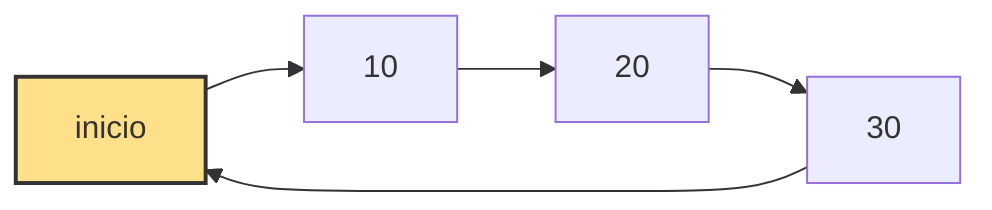

A lista encadeada circular é uma variação da lista simplesmente encadeada onde o último nó não aponta para null, mas sim para o primeiro nó da estrutura. Isso forma um ciclo contínuo de navegação.

Essa estrutura elimina o fim “nulo” da lista, permitindo percorrer os elementos indefinidamente enquanto houver controle externo de parada.

Assim como na lista encadeada comum, cada nó contém um valor e uma referência para o próximo nó.

## Estrutura

Cada nó possui um valor e um ponteiro para o próximo elemento da lista.

```java id="n1c0d0"
class No {
    int valor;
    No proximo;

    public No(int valor) {
        this.valor = valor;
        this.proximo = null;
    }
}
````

A lista mantém dois ponteiros principais: inicio e fim. O fim sempre aponta de volta para o inicio, fechando o ciclo.

```java id="l1s7c0"
private No inicio;
private No fim;
private int tamanho;
```

## Representação estrutural

A lista circular forma um ciclo contínuo entre os nós.


class ListaCircular {

- inicio: No
- fim: No
- tamanho: int

+ adicionarInicio(valor: int)
+ adicionarFim(valor: int)
+ removerInicio(): int
+ removerFim(): int
+ obterInicio(): int
+ obterFim(): int
+ obter(indice: int): int
+ inserir(indice: int, valor: int)
+ remover(indice: int): int
+ percorrer()
}

class No {

- valor: int
- proximo: No
}


## Representação visual da circularidade

A característica principal é o último nó apontando para o primeiro, formando um ciclo.



Não existe referência nula no final, o que altera a lógica de travessia da estrutura.

## Ideia principal

A lista encadeada circular permite percorrer os elementos continuamente. O controle de parada deve ser feito manualmente, geralmente comparando o nó atual com o inicio.

Essa estrutura é útil em sistemas que exigem ciclos contínuos, como escalonamento de processos ou buffers circulares.

## Adicionar no início

O método adicionarInicio insere um novo nó no começo e mantém a circularidade atualizando o fim.

```java id="a1i0c0"
public void adicionarInicio(int valor) {
    No novo = new No(valor);

    if (inicio == null) {
        fim = novo;
        inicio =  fim;
        fim.proximo = inicio;
    } else {
        novo.proximo = inicio;
        inicio = novo;
        fim.proximo = inicio;
    }

    tamanho++;
}
```

## Adicionar no fim

O método adicionarFim insere um novo elemento no final e reconecta o ponteiro circular.

```java id="a1f0c0"
public void adicionarFim(int valor) {
    No novo = new No(valor);

    if (inicio == null) {
        fim = novo;
        inicio = fim;
        fim.proximo = inicio;
    } else {
        fim.proximo = novo;
        fim = novo;
        fim.proximo = inicio;
    }

    tamanho++;
}
```

## Remover do início

O método removerInicio remove o primeiro elemento e ajusta a referência circular.

```java id="r1i0c0"
public int removerInicio() {
    if (inicio == null) throw new RuntimeException("Lista vazia");

    int valor = inicio.valor;

    if (inicio == fim) {
        inicio = fim = null;
    } else {
        inicio = inicio.proximo;
        fim.proximo = inicio;
    }

    tamanho--;
    return valor;
}
```

## Remover do fim

O método removerFim percorre a lista até encontrar o penúltimo nó.

```java id="r1f0c0"
public int removerFim() {
    if (inicio == null) throw new RuntimeException("Lista vazia");

    int valor = fim.valor;

    if (inicio == fim) {
        inicio = fim = null;
    } else {
        No atual = inicio;

        while (atual.proximo != fim) {
            atual = atual.proximo;
        }

        fim = atual;
        fim.proximo = inicio;
    }

    tamanho--;
    return valor;
}
```

## Obter primeiro elemento

Retorna o valor do nó inicial.

```java id="g1i0c0"
public int obterInicio() {
    if (inicio == null) throw new RuntimeException("Lista vazia");
    return inicio.valor;
}
```

## Obter último elemento

Retorna o valor do nó final.

```java id="g1f0c0"
public int obterFim() {
    if (fim == null) throw new RuntimeException("Lista vazia");
    return fim.valor;
}
```

## Obter por índice

Percorre a lista controlando manualmente o ciclo.

```java id="g1idx"
public int obter(int indice) {
    if (indice < 0 || indice >= tamanho)
        throw new IndexOutOfBoundsException();

    No atual = inicio;

    for (int i = 0; i < indice; i++) {
        atual = atual.proximo;
    }

    return atual.valor;
}
```

## Inserir em posição

Insere um elemento em qualquer posição mantendo o ciclo ativo.

```java id="i1c0c0"
public void inserir(int indice, int valor) {
    if (indice < 0 || indice > tamanho)
        throw new IndexOutOfBoundsException();

    if (indice == 0) {
        adicionarInicio(valor);
        return;
    }

    if (indice == tamanho) {
        adicionarFim(valor);
        return;
    }

    No novo = new No(valor);
    No atual = inicio;

    for (int i = 0; i < indice - 1; i++) {
        atual = atual.proximo;
    }

    novo.proximo = atual.proximo;
    atual.proximo = novo;

    tamanho++;
}
```

## Remover por índice

Remove um elemento ajustando a ligação circular.

```java id="r1idx"
public int remover(int indice) {
    if (indice < 0 || indice >= tamanho)
        throw new IndexOutOfBoundsException();

    if (indice == 0) return removerInicio();
    if (indice == tamanho - 1) return removerFim();

    No atual = inicio;

    for (int i = 0; i < indice - 1; i++) {
        atual = atual.proximo;
    }

    int valor = atual.proximo.valor;
    atual.proximo = atual.proximo.proximo;

    tamanho--;
    return valor;
}
```

## Percorrer lista

A travessia deve parar quando retorna ao início para evitar loop infinito.

```java id="p1c0c0"
public void percorrer() {
    if (inicio == null) return;

    No atual = inicio;

    do {
        System.out.println(atual.valor);
        atual = atual.proximo;
    } while (atual != inicio);
}
```

## Complexidade dos métodos (Big O)

A estrutura mantém desempenho semelhante à lista simplesmente encadeada, com diferenças no controle do fim.

| Método          | Melhor caso | Caso médio | Pior caso |
| --------------- | ----------- | ---------- | --------- |
| adicionarInicio | O(1)        | O(1)       | O(1)      |
| adicionarFim    | O(1)        | O(1)       | O(1)      |
| removerInicio   | O(1)        | O(1)       | O(1)      |
| removerFim      | O(n)        | O(n)       | O(n)      |
| obterInicio     | O(1)        | O(1)       | O(1)      |
| obterFim        | O(1)        | O(1)       | O(1)      |
| obter(indice)   | O(1)        | O(n)       | O(n)      |
| inserir(indice) | O(1)        | O(n)       | O(n)      |
| remover(indice) | O(1)        | O(n)       | O(n)      |
| percorrer       | O(n)        | O(n)       | O(n)      |

## Exemplo de uso

Exemplo prático da estrutura circular em Java.

```java id="ex1c0c0"
public class ListaCircular {

    private No inicio;
    private No fim;
    private int tamanho;

    private static class No {
        int valor;
        No proximo;

        public No(int valor) {
            this.valor = valor;
        }
    }

    public void adicionarFim(int valor) {
        No novo = new No(valor);

        if (inicio == null) {
            fim = novo;
            inicio = fim;
            fim.proximo = inicio;
        } else {
            fim.proximo = novo;
            fim = novo;
            fim.proximo = inicio;
        }

        tamanho++;
    }

    public void percorrer() {
        if (inicio == null) return;

        No atual = inicio;

        do {
            System.out.println(atual.valor);
            atual = atual.proximo;
        } while (atual != inicio);
    }

    public static void main(String[] args) {

        ListaCircular lista = new ListaCircular();

        lista.adicionarFim(10);
        lista.adicionarFim(20);
        lista.adicionarFim(30);
        lista.adicionarFim(40);

        lista.percorrer();
    }
}
```

Neste exemplo, os elementos são conectados em ciclo. O método percorrer precisa de controle explícito para evitar repetição infinita.

## Conclusão

A lista encadeada circular elimina o conceito de fim nulo e permite navegação contínua entre os elementos. Sua principal vantagem está na estrutura cíclica, útil em sistemas que exigem repetição constante de elementos.
