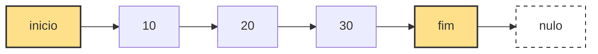

Uma lista simplesmente encadeada é uma estrutura de dados linear baseada em nós conectados por referências. Cada nó contém um valor e um ponteiro para o próximo elemento da sequência.

A estrutura mantém dois ponteiros principais: inicio, que aponta para o primeiro elemento, e fim, que aponta diretamente para o último elemento.

Diferente de arrays, os elementos não ocupam posições contíguas na memória. Eles são alocados dinamicamente e conectados logicamente por referências.

## Estrutura

A estrutura é composta por nós individuais e pela classe que controla a lista.

```java id="n3k8aa"
class No {
    int valor;
    No proximo;

    public No(int valor) {
        this.valor = valor;
        this.proximo = null;
    }
}
```

A lista mantém três informações essenciais: inicio, fim e tamanho.

```java id="l7m2bb"
private No inicio;
private No fim;
private int tamanho;
```


class ListaSimplesEncadeada {

- inicio: No
- fim: No
- tamanho: int
+ adicionarInicio(valor: int)
+ adicionarFim(valor: int)
+ removerInicio(): int
+ removerFim(): int
+ obterInicio(): int
+ obterFim(): int
+ obter(indice: int): int
+ inserir(indice: int, valor: int)
+ remover(indice: int): int
+ percorrer()
  }

class No {

- valor: int
- proximo: No
  }
  

## Representação visual da lista

A lista é composta por nós encadeados sequencialmente. O inicio aponta para o primeiro elemento e o fim aponta para o último.



Cada nó conhece apenas seu próximo elemento.

## Ideia principal

A estrutura permite crescimento dinâmico sem necessidade de realocação de memória. Os elementos são ligados por referências.

Com inicio e fim, operações nas extremidades são eficientes, pois não exigem percurso da lista.

## Adicionar no início

O método adicionarInicio insere um novo elemento no começo da lista. O novo nó passa a apontar para o antigo inicio.

```java id="af1"
public void adicionarInicio(int valor) {
    No novo = new No(valor);

    if (inicio == null) {
        fim = novo;
        inicio = fim;
    } else {
        novo.proximo = inicio;
        inicio = novo;
    }

    tamanho++;
}
```

Essa operação é constante porque não depende do tamanho da lista.

## Adicionar no fim

O método adicionarFim insere um elemento no final da lista usando o ponteiro fim.

```java id="af2"
public void adicionarFim(int valor) {
    No novo = new No(valor);

    if (inicio == null) {
        fim = novo;
        inicio = fim;
    } else {
        fim.proximo = novo;
        fim = novo;
    }

    tamanho++;
}
```

Essa operação também é constante devido ao uso de fim.

## Remover do início

O método removerInicio remove o primeiro elemento e atualiza o ponteiro inicio.

```java id="rf1"
public int removerInicio() {
    if (inicio == null) throw new RuntimeException("Lista vazia");

    int valor = inicio.valor;
    inicio = inicio.proximo;

    if (inicio == null) {
        fim = null;
    }

    tamanho--;
    return valor;
}
```

## Remover do fim

O método removerFim percorre a lista até o penúltimo elemento para atualizar o fim.

```java id="rf2"
public int removerFim() {
    if (inicio == null) throw new RuntimeException("Lista vazia");

    if (inicio == fim) {
        int v = inicio.valor;
        inicio = fim = null;
        tamanho--;
        return v;
    }

    No atual = inicio;

    while (atual.proximo != fim) {
        atual = atual.proximo;
    }

    int valor = fim.valor;
    fim = atual;
    fim.proximo = null;

    tamanho--;
    return valor;
}
```

Essa operação é linear.

## Obter primeiro elemento

O método obterInicio retorna o valor do primeiro nó.

```java id="gi1"
public int obterInicio() {
    if (inicio == null) throw new RuntimeException("Lista vazia");
    return inicio.valor;
}
```

## Obter último elemento

O método obterFim retorna o valor do último nó usando fim.

```java id="gf1"
public int obterFim() {
    if (fim == null) throw new RuntimeException("Lista vazia");
    return fim.valor;
}
```

## Obter por índice

O método obter percorre a lista até o índice desejado.

```java id="gi2"
public int obter(int indice) {
    if (indice < 0 || indice >= tamanho)
        throw new IndexOutOfBoundsException();

    No atual = inicio;

    for (int i = 0; i < indice; i++) {
        atual = atual.proximo;
    }

    return atual.valor;
}
```

## Inserir em posição

O método inserir adiciona um elemento em qualquer posição da lista.

```java id="in1"
public void inserir(int indice, int valor) {
    if (indice < 0 || indice > tamanho)
        throw new IndexOutOfBoundsException();

    if (indice == 0) {
        adicionarInicio(valor);
        return;
    }

    if (indice == tamanho) {
        adicionarFim(valor);
        return;
    }

    No novo = new No(valor);
    No atual = inicio;

    for (int i = 0; i < indice - 1; i++) {
        atual = atual.proximo;
    }

    novo.proximo = atual.proximo;
    atual.proximo = novo;

    tamanho++;
}
```

## Remover por índice

O método remover elimina um elemento em qualquer posição.

```java id="rm1"
public int remover(int indice) {
    if (indice < 0 || indice >= tamanho)
        throw new IndexOutOfBoundsException();

    if (indice == 0) return removerInicio();
    if (indice == tamanho - 1) return removerFim();

    No atual = inicio;

    for (int i = 0; i < indice - 1; i++) {
        atual = atual.proximo;
    }

    int valor = atual.proximo.valor;
    atual.proximo = atual.proximo.proximo;

    tamanho--;
    return valor;
}
```

## Percorrer lista

O método percorre todos os elementos da lista.

```java id="pc1"
public void percorrer() {
    No atual = inicio;

    while (atual != null) {
        System.out.println(atual.valor);
        atual = atual.proximo;
    }
}
```

## Complexidade dos métodos (Big O)

A análise de complexidade mostra o custo de execução de cada operação conforme o tamanho da lista cresce. Em listas simplesmente encadeadas, o desempenho depende principalmente do acesso sequencial aos nós e do uso dos ponteiros inicio e fim.

| Método            | Melhor caso | Caso médio | Pior caso |
|------------------|-------------|------------|-----------|
| adicionarInicio   | O(1)        | O(1)       | O(1)      |
| adicionarFim      | O(1)        | O(1)       | O(1)      |
| removerInicio     | O(1)        | O(1)       | O(1)      |
| removerFim        | O(n)        | O(n)       | O(n)      |
| obterInicio       | O(1)        | O(1)       | O(1)      |
| obterFim          | O(1)        | O(1)       | O(1)      |
| obter(indice)     | O(1)        | O(n)       | O(n)      |
| inserir(indice)   | O(1)        | O(n)       | O(n)      |
| remover(indice)   | O(1)        | O(n)       | O(n)      |
| percorrer         | O(n)        | O(n)       | O(n)      |


## Exemplo de uso

O exemplo abaixo demonstra como a lista simplesmente encadeada pode ser utilizada na prática. São realizadas operações de inserção no início e no fim, acesso aos elementos e remoção, mostrando como a estrutura se comporta de forma dinâmica durante a execução.

```java
public class ListaSimplesEncadeada {

    private No inicio;
    private No fim;
    private int tamanho;

    private static class No {
        int valor;
        No proximo;

        public No(int valor) {
            this.valor = valor;
            this.proximo = null;
        }
    }

    public void adicionarInicio(int valor) {
        No novo = new No(valor);

        if (inicio == null) {
            inicio = fim = novo;
        } else {
            novo.proximo = inicio;
            inicio = novo;
        }

        tamanho++;
    }

    public void adicionarFim(int valor) {
        No novo = new No(valor);

        if (inicio == null) {
            inicio = fim = novo;
        } else {
            fim.proximo = novo;
            fim = novo;
        }

        tamanho++;
    }

    public int obterInicio() {
        if (inicio == null)
            throw new RuntimeException("Lista vazia");

        return inicio.valor;
    }

    public int obterFim() {
        if (fim == null)
            throw new RuntimeException("Lista vazia");

        return fim.valor;
    }

    public int obter(int indice) {
        if (indice < 0 || indice >= tamanho)
            throw new IndexOutOfBoundsException();

        No atual = inicio;

        for (int i = 0; i < indice; i++) {
            atual = atual.proximo;
        }

        return atual.valor;
    }

    public int removerInicio() {
        if (inicio == null)
            throw new RuntimeException("Lista vazia");

        int valor = inicio.valor;
        inicio = inicio.proximo;

        if (inicio == null) {
            fim = null;
        }

        tamanho--;
        return valor;
    }

    public int removerFim() {
        if (inicio == null)
            throw new RuntimeException("Lista vazia");

        if (inicio == fim) {
            int valor = inicio.valor;
            inicio = fim = null;
            tamanho--;
            return valor;
        }

        No atual = inicio;

        while (atual.proximo != fim) {
            atual = atual.proximo;
        }

        int valor = fim.valor;
        fim = atual;
        fim.proximo = null;

        tamanho--;

        return valor;
    }

    public void inserir(int indice, int valor) {
        if (indice < 0 || indice > tamanho)
            throw new IndexOutOfBoundsException();

        if (indice == 0) {
            adicionarInicio(valor);
            return;
        }

        if (indice == tamanho) {
            adicionarFim(valor);
            return;
        }

        No novo = new No(valor);
        No atual = inicio;

        for (int i = 0; i < indice - 1; i++) {
            atual = atual.proximo;
        }

        novo.proximo = atual.proximo;
        atual.proximo = novo;

        tamanho++;
    }

    public int remover(int indice) {
        if (indice < 0 || indice >= tamanho)
            throw new IndexOutOfBoundsException();

        if (indice == 0)
            return removerInicio();

        if (indice == tamanho - 1)
            return removerFim();

        No atual = inicio;

        for (int i = 0; i < indice - 1; i++) {
            atual = atual.proximo;
        }

        int valor = atual.proximo.valor;
        atual.proximo = atual.proximo.proximo;

        tamanho--;

        return valor;
    }

    public void percorrer() {
        No atual = inicio;

        while (atual != null) {
            System.out.println(atual.valor);
            atual = atual.proximo;
        }
    }

    public int tamanho() {
        return tamanho;
    }

    public static void main(String[] args) {

        Lista lista = new Lista();

        lista.adicionarInicio(20);
        lista.adicionarInicio(10);
        lista.adicionarFim(30);
        lista.adicionarFim(40);

        System.out.println("Primeiro elemento: " + lista.obterInicio());
        System.out.println("Último elemento: " + lista.obterFim());

        System.out.println("Elemento na posição 2: " + lista.obter(2));

        lista.removerInicio();
        lista.removerFim();

        lista.inserir(1, 25);

        lista.percorrer();
    }
}
```

Neste exemplo, a lista inicia vazia e vai sendo construída dinamicamente. Primeiro são adicionados elementos no início, o que faz com que eles sejam inseridos antes dos já existentes. Em seguida, são adicionados elementos no final utilizando o ponteiro fim, o que evita percorrer toda a estrutura.

Após a construção inicial, são realizados acessos diretos ao primeiro e ao último elemento, operações que são constantes devido ao uso dos ponteiros inicio e fim. Também é demonstrado o acesso por índice, que exige percorrer a lista até a posição desejada.

Por fim, são realizadas remoções nas extremidades e uma inserção em posição intermediária. A chamada de percorrer exibe o estado final da lista, permitindo visualizar como as operações alteram a estrutura ao longo do tempo.

## Exemplo de uso da `LinkedList` em Java

A classe `LinkedList` da plataforma Java já implementa uma lista duplamente encadeada pronta para uso, fazendo parte do Java Collections Framework. Ela permite inserções e remoções eficientes em ambas as extremidades, além de suportar operações de fila e deque.

O exemplo abaixo demonstra como a `LinkedList` pode ser utilizada na prática. São realizadas operações de inserção no início e no fim, acesso aos elementos e remoção, mostrando como a estrutura se comporta de forma dinâmica durante a execução.

```java
import java.util.LinkedList;

public class ExemploLinkedList {

    public static void main(String[] args) {

        LinkedList<Integer> lista = new LinkedList<>();

        // Inserções
        lista.addFirst(20);
        lista.addFirst(10);
        lista.addLast(30);
        lista.addLast(40);

        System.out.println("Primeiro elemento: " + lista.getFirst());
        System.out.println("Último elemento: " + lista.getLast());

        System.out.println("Elemento na posição 2: " + lista.get(2));

        // Remoções
        lista.removeFirst();
        lista.removeLast();

        // Inserção em posição intermediária
        lista.add(1, 25);

        // Percorrer a lista
        for (Integer valor : lista) {
            System.out.println(valor);
        }
    }
}
```

Neste exemplo, a lista inicia vazia e vai sendo construída dinamicamente. Primeiro são adicionados elementos no início com `addFirst`, o que faz com que eles sejam inseridos antes dos já existentes. Em seguida, são adicionados elementos no final utilizando `addLast`, operação otimizada pela própria estrutura da `LinkedList`.

Após a construção inicial, são realizados acessos diretos ao primeiro e ao último elemento com `getFirst` e `getLast`, operações que são constantes devido aos ponteiros internos mantidos pela estrutura. Também é demonstrado o acesso por índice com `get`, que exige percorrer a lista até a posição desejada.

Por fim, são realizadas remoções nas extremidades e uma inserção em posição intermediária. A iteração final com `for-each` exibe o estado atual da lista, permitindo visualizar como as operações alteram a estrutura ao longo do tempo.


## Conclusão

A lista simplesmente encadeada com inicio e fim oferece uma estrutura eficiente para operações nas extremidades e flexível para crescimento dinâmico. A padronização dos métodos em português torna a implementação mais legível e consistente, especialmente em contextos educacionais e de aprendizado de estruturas de dados.
